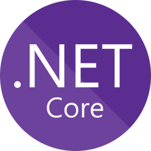

# 

ASP.NET Core codebase containing real world examples (CRUD, auth, advanced patterns, etc) that adheres to the [RealWorld](https://github.com/gothinkster/realworld-example-apps) spec and API.

## [RealWorld](https://github.com/gothinkster/realworld)

This codebase was created to demonstrate a fully fledged fullstack application built with ASP.NET Core (with Feature orientation) including CRUD operations, authentication, routing, pagination, and more.

We've gone to great lengths to adhere to the ASP.NET Core community styleguides & best practices.

For more information on how to this works with other frontends/backends, head over to the [RealWorld](https://github.com/gothinkster/realworld) repo.

## Usage

### PostgreSQL

This project use **PostgreSQL** as main database provider. You can run it easily via `docker-compose up -d`.

Two databases will spin up, one for normal development and one dedicated for integrations tests. Indeed In-Memory testing are poorly suitable for real integrations tests for me. See [Avoid In-Memory Databases for Tests](https://jimmybogard.com/avoid-in-memory-databases-for-tests/).

Besides there is no support for cascading foreign keys and no support for Automapper Projection feature. Of course the big con of real database testing is no parallel support so far slower, **7s** (real db) vs **1s** (parallelized in memory db) in my machine.

### Run app

```sh
make seed # migrate and fill db with fake data
make run
```

And that's all, go to <http://localhost:5000/swagger>

### Validate API with Newman

Launch follow scripts for validating realworld schema :

```sh
make fresh # wipe all database for clean state
make run
newman run postman.json --global-var "APIURL=http://localhost:5000" --global-var="USERNAME=johndoe" --global-var="EMAIL=john.doe@example.com" --global-var="PASSWORD=password"
```

### Full test suite

This project is fully tested via xunit, just run `make test` for launching it. All SQL queries are automatically showed up for easy debug and easy N+1 detection.

Use `make test-watch-app` for realtime test watching, perfect for TDD.

### Publishing

Use `make publish` for publishing the app. Be sure to have PostgreSQL running before. This will execute all pipeline with code format checking, building, testing then publishing under `publish` directory.

The local `Dockerfile` is suitable as production container.
